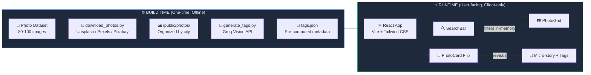
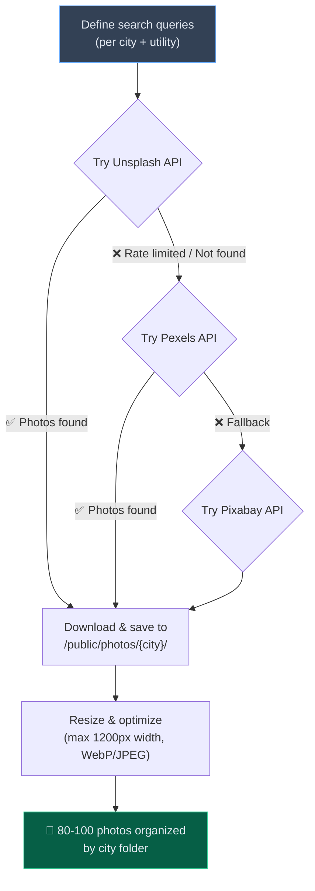
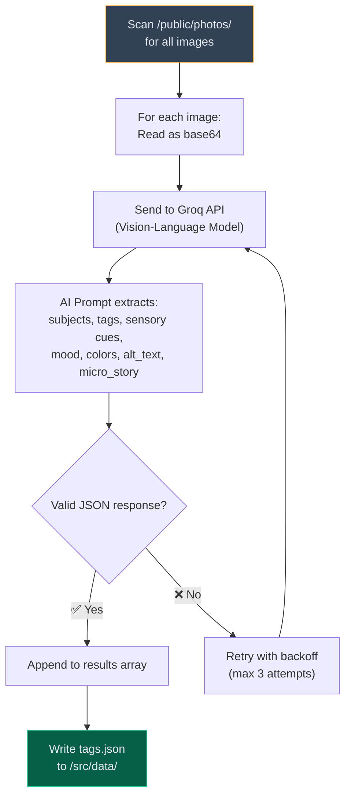
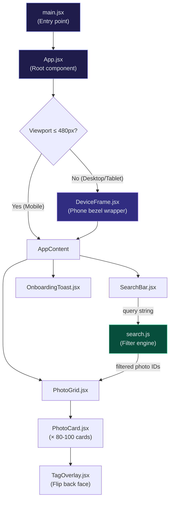
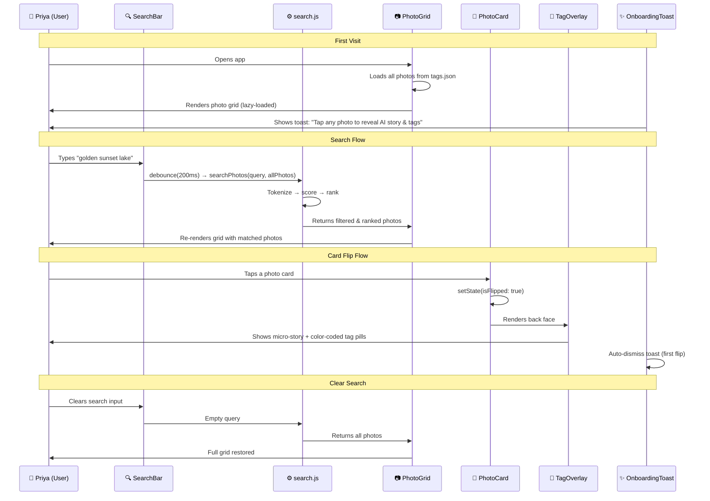
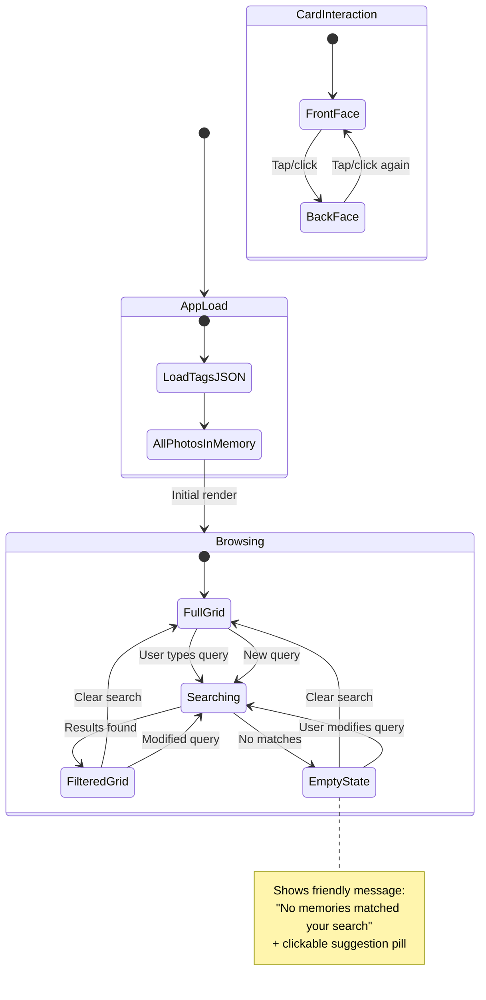
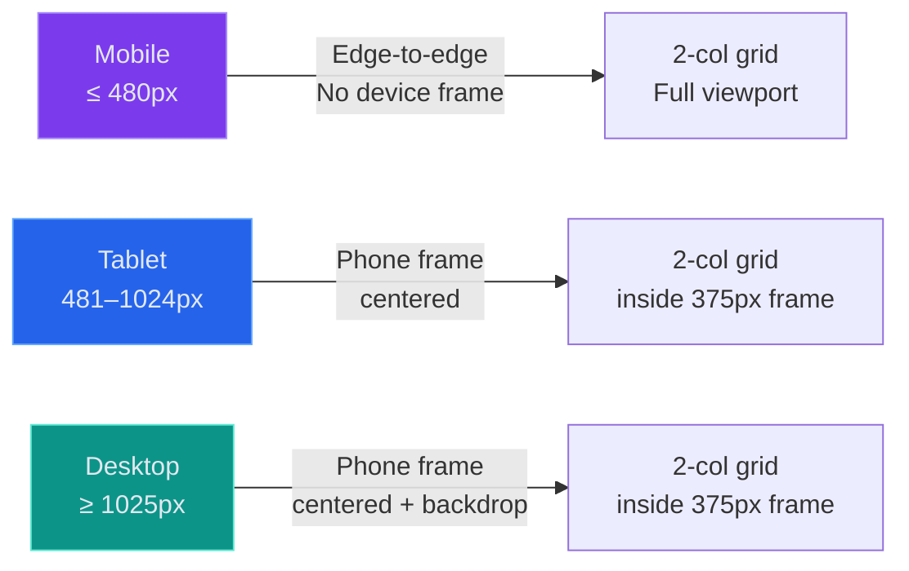
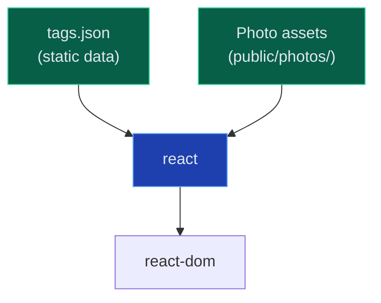

# 🏗️ Architecture — Google Photos Memory Search MVP

> **System purpose:** A static, pre-computed photo search experience that uses AI-generated visual & sensory tags to let users find photos the way they *remember* them — by mood, color, texture, and scene — not by date or GPS.

---

## 1. System Overview

The architecture is split into two completely decoupled phases:



### Key Architectural Decisions

| Decision | Rationale |
|----------|-----------|
| **Pre-computed tags (no runtime AI)** | Zero latency search; no API costs at runtime; offline-capable |
| **Static JSON as data store** | No database overhead; bundled with the app; version-controllable |
| **Client-side search** | Instant filtering; no backend needed; works with 80-100 photos without perf issues |
| **React + Vite** | Component model ideal for card grid + flip interactions; Vite for fast dev builds |
| **Tailwind CSS** | Utility-first for rapid responsive styling; phone-frame layout + dark mode |
| **Phone frame on desktop** | Mobile-first demo should feel native on all screens |

---

## 2. Build-Time Pipeline

The build pipeline runs **once** (or whenever the photo dataset changes) and produces the static assets consumed by the React app.

### 2.1 Photo Download Pipeline



**Script:** [`scripts/download_photos.py`](file:///c:/Users/panka/Documents/Pankaj_CodeSpace/AI_Projects/GooglePhotos_MVP/scripts/download_photos.py)

| Config | Value |
|--------|-------|
| **Sources** | Unsplash → Pexels → Pixabay (fallback chain) |
| **Total photos** | 80–100 |
| **Distribution** | Udaipur (20-25), Manali (20-25), Hampi (20-25), Goa (10-15), Travel Utility (10-15) |
| **Output format** | JPEG, max 1200px width (optimized for web) |
| **Naming** | `{city}_{###}.jpg` (e.g., `udaipur_001.jpg`) |

#### Output Directory Structure

```
public/photos/
├── udaipur/          # 20-25 photos
│   ├── udaipur_001.jpg
│   ├── udaipur_002.jpg
│   └── ...
├── manali/           # 20-25 photos
│   ├── manali_001.jpg
│   └── ...
├── hampi/            # 20-25 photos
│   ├── hampi_001.jpg
│   └── ...
├── goa/              # 10-15 photos
│   ├── goa_001.jpg
│   └── ...
└── travel_utility/   # 10-15 photos
    ├── utility_001.jpg
    └── ...
```

### 2.2 Tag Generation Pipeline



**Script:** [`scripts/generate_tags.py`](file:///c:/Users/panka/Documents/Pankaj_CodeSpace/AI_Projects/GooglePhotos_MVP/scripts/generate_tags.py)

| Config | Value |
|--------|-------|
| **API** | Groq (free tier) |
| **Model** | LLaVA 1.5 or Llama 3.2 Vision (whichever is available free on Groq) |
| **Input** | Base64-encoded image per request |
| **Output** | Structured JSON per photo |
| **Rate limiting** | Batch with 2-3s delays between requests to respect free tier limits |
| **Error handling** | Retry up to 3× with exponential backoff; log failures |

#### AI Prompt Design

The prompt instructs the model to return a strict JSON object:

```
You are analyzing a travel photo from a trip to {city}, India. 
Extract the following metadata as a JSON object:

{
  "primary_subjects": [...],     // 3-5 core objects/entities
  "descriptive_tags": [...],     // 4-6 rich visual descriptions  
  "sensory_cues": [...],         // 4-6 textures, temperatures, sounds, feelings
  "mood_and_tone": [...],        // 2-3 emotional descriptors
  "dominant_colors": [...],      // 3-5 prominent colors
  "alt_text": "...",             // One descriptive sentence
  "micro_story": "..."          // 1-2 sentence narrative from the perspective 
                                 // of a 28-year-old traveler named Priya
}

Be specific and evocative. Avoid generic tags. Focus on what makes 
this photo unique — the sensory details someone would remember.
```

#### Tag Schema (per photo)

```json
{
  "id": "udaipur_001",
  "filename": "udaipur_001.jpg",
  "city": "Udaipur",
  "primary_subjects": ["palace", "lake", "reflection"],
  "descriptive_tags": ["white marble palace", "calm lake water", "mountain backdrop", "evening sky"],
  "sensory_cues": ["serene", "cool breeze", "golden light", "still water", "warm glow"],
  "mood_and_tone": ["peaceful", "majestic", "nostalgic"],
  "dominant_colors": ["gold", "white", "deep blue", "amber"],
  "alt_text": "A grand white marble palace reflected in the calm waters of Lake Pichola during golden hour in Udaipur",
  "micro_story": "The last light of the day painted the City Palace in gold as Priya stood at the ghat, watching the palace's perfect reflection shimmer on Lake Pichola. The evening felt impossibly still."
}
```

#### Complete `tags.json` Structure

```json
{
  "generated_at": "2026-10-03T00:00:00Z",
  "model": "llava-v1.5-7b-4096-preview",
  "total_photos": 90,
  "photos": [
    { "id": "udaipur_001", "filename": "udaipur_001.jpg", "city": "Udaipur", ... },
    { "id": "udaipur_002", "filename": "udaipur_002.jpg", "city": "Udaipur", ... },
    ...
    { "id": "utility_010", "filename": "utility_010.jpg", "city": "Travel Utility", ... }
  ]
}
```

---

## 3. Runtime Architecture (React App)

The runtime is a **purely static, client-side React application** with zero backend dependencies.

### 3.1 High-Level Component Tree



### 3.2 Component Specifications

#### `App.jsx` — Root Component

| Responsibility | Detail |
|----------------|--------|
| **Data loading** | Imports `tags.json` at build time (static import, bundled by Vite) |
| **State management** | `searchQuery` (string), `filteredPhotos` (array), `toastDismissed` (boolean) |
| **Viewport detection** | CSS media query or `window.matchMedia` to toggle `DeviceFrame` wrapper |
| **Layout** | Renders `SearchBar` → `PhotoGrid` → `OnboardingToast` |

---

#### `DeviceFrame.jsx` — Phone Frame Wrapper

Renders a realistic phone bezel around the app on **desktop and tablet** viewports.

```
┌─────────────────────────────────────────┐
│            Dark gradient backdrop        │
│                                         │
│    ┌─────────────────────────────┐      │
│    │  ┌───────────────────────┐  │      │
│    │  │    📱 App Content     │  │      │
│    │  │                       │  │      │
│    │  │   SearchBar           │  │      │
│    │  │   PhotoGrid           │  │      │
│    │  │   OnboardingToast     │  │      │
│    │  │                       │  │      │
│    │  └───────────────────────┘  │      │
│    │      Phone bezel (CSS)      │      │
│    └─────────────────────────────┘      │
│                                         │
└─────────────────────────────────────────┘
```

| Property | Value |
|----------|-------|
| **Frame dimensions** | ~375×812px (iPhone/Pixel aspect ratio) |
| **Frame style** | Rounded corners, dark bezel, subtle shadow, notch/status bar |
| **Content** | Scrollable inner container with overflow-y |
| **Hidden when** | Viewport width ≤ 480px (mobile breakpoint) |
| **Implementation** | Pure CSS with Tailwind — `rounded-[2.5rem]`, `border`, `shadow-2xl`, centered with `mx-auto` |

---

#### `SearchBar.jsx` — Natural Language Search Input

| Property | Detail |
|----------|--------|
| **Position** | Sticky top inside the app content area |
| **Behavior** | Controlled input; `onChange` triggers search on every keystroke |
| **Debounce** | 200ms debounce to avoid excessive re-renders |
| **Clear button** | ✕ icon appears when query is non-empty |
| **Placeholder** | *"Search memories… try 'golden sunset lake'"* |
| **Styling** | Glassmorphism background, rounded-full, search icon prefix |

**Data flow:**
```
User types → onChange → debounce(200ms) → searchPhotos(query, tags.json) → setFilteredPhotos(results)
```

---

#### `PhotoGrid.jsx` — Responsive Photo Grid

| Property | Detail |
|----------|--------|
| **Layout** | CSS Grid: 2 columns on mobile (inside phone frame) |
| **Grouping** | Photos grouped by `city` field with sticky city label dividers |
| **Lazy loading** | `IntersectionObserver` — load images only when entering viewport |
| **Image element** | `` with blurred placeholder while loading |
| **Empty state** | Friendly illustrated empty state (see spec below) |

**Empty State Spec (when search returns zero results):**

```
    ┌─────────────────────────────┐
    │                             │
    │        🔍 (muted icon)      │
    │                             │
    │   "No memories matched      │
    │    your search"             │
    │                             │
    │   Try something like:       │
    │   ┌───────────────────┐     │
    │   │ golden sunset lake│     │
    │   └───────────────────┘     │
    │   (clickable suggestion)    │
    │                             │
    └─────────────────────────────┘
```

- **Headline:** *"No memories matched your search"*
- **Subtext:** *"Try describing what you remember — a color, a feeling, or a scene"*
- **Suggestion pill:** A clickable example query (e.g., `golden sunset lake`) that auto-fills the search bar when tapped
- **Tone:** Warm, encouraging — never blame the user
- **Styling:** Centered, muted text (`text-gray-400`), subtle icon, fade-in animation
| **Transition** | Fade-in animation when photos enter the viewport |

**Props:**
```typescript
interface PhotoGridProps {
  photos: PhotoMetadata[]     // Filtered (or all) photos from tags.json
  onPhotoClick: (id: string) => void
}
```

---

#### `PhotoCard.jsx` — Flippable Photo Card

The core interactive element — click/tap to flip and reveal AI-generated content.

```
                FRONT                              BACK
    ┌─────────────────────┐          ┌─────────────────────┐
    │                     │          │  📖 Micro Story      │
    │                     │          │  ─────────────────   │
    │     📸 Photo        │  ──3D──► │  🏷️ Tag Pills       │
    │     (full bleed)    │  flip    │  [serene] [golden]   │
    │                     │          │  [palace] [peaceful] │
    │                     │          │  [warm glow]         │
    └─────────────────────┘          └─────────────────────┘
```

| Property | Detail |
|----------|--------|
| **Flip trigger** | `onClick` / `onTouchEnd` |
| **Animation** | CSS 3D transform: `rotateY(180deg)`, `perspective(1000px)`, `transition: 0.6s` |
| **Front face** | Photo image (full bleed, object-cover) |
| **Back face** | `TagOverlay` component |
| **State** | Local `isFlipped` boolean per card |

**CSS 3D Flip Implementation:**
```css
/* Card container */
.card { perspective: 1000px; }

/* Inner wrapper that rotates */
.card-inner {
  transition: transform 0.6s;
  transform-style: preserve-3d;
}
.card-inner.flipped {
  transform: rotateY(180deg);
}

/* Both faces */
.card-front, .card-back {
  backface-visibility: hidden;
  position: absolute;
  inset: 0;
}

/* Back face pre-rotated */
.card-back {
  transform: rotateY(180deg);
}
```

---

#### `TagOverlay.jsx` — Flip Back Face Content

Displays the AI-generated story and tags when a card is flipped.

| Property | Detail |
|----------|--------|
| **Micro story** | 1-2 line narrative in italic, top section |
| **Tag pills** | Color-coded by category, wrapped in a flex container |
| **Background** | Dark semi-transparent overlay with blur |
| **Scroll** | Overflow-y auto if content exceeds card height |

**Tag pill color coding:**

| Category | Color (Tailwind) | Example |
|----------|-----------------|---------|
| `primary_subjects` | `bg-blue-500/20 text-blue-300` | `palace`, `lake` |
| `sensory_cues` | `bg-amber-500/20 text-amber-300` | `warm glow`, `cool breeze` |
| `mood_and_tone` | `bg-purple-500/20 text-purple-300` | `peaceful`, `nostalgic` |
| `dominant_colors` | `bg-emerald-500/20 text-emerald-300` | `gold`, `deep blue` |
| `descriptive_tags` | `bg-slate-500/20 text-slate-300` | `calm lake water` |

---

#### `OnboardingToast.jsx` — First-Time Hint

| Property | Detail |
|----------|--------|
| **Content** | ✨ *"Tap any photo to reveal the AI-generated story and tags behind it"* |
| **Position** | Fixed bottom, horizontally centered, `z-50` |
| **Dismiss** | ✕ button on right; auto-dismiss after 8s; dismiss on first card flip |
| **Persistence** | `localStorage.getItem('onboarding_toast_dismissed')` |
| **Style** | Glassmorphism pill: `backdrop-blur-xl`, `bg-white/10`, gradient border |
| **Animation** | Slide-up on appear, fade-out on dismiss |

---

### 3.3 Search Engine (`utils/search.js`)

A client-side, in-memory search that scores photos against a natural language query.


#### Scoring Algorithm

```javascript
function searchPhotos(query, photos) {
  const tokens = query.toLowerCase().split(/\s+/).filter(Boolean);
  if (tokens.length === 0) return photos; // Empty query → show all

  const SEARCHABLE_FIELDS = [
    'primary_subjects',   // Array of strings
    'descriptive_tags',   // Array of strings
    'sensory_cues',       // Array of strings
    'mood_and_tone',      // Array of strings
    'dominant_colors',    // Array of strings
    'alt_text',           // Single string
  ];

  // Note: micro_story is NOT searched — it's for display only

  return photos
    .map(photo => {
      let score = 0;
      const searchableText = SEARCHABLE_FIELDS
        .map(field => {
          const value = photo[field];
          return Array.isArray(value) ? value.join(' ') : value;
        })
        .join(' ')
        .toLowerCase();

      tokens.forEach(token => {
        if (searchableText.includes(token)) score++;
      });

      return { ...photo, _score: score };
    })
    .filter(p => p._score > 0)
    .sort((a, b) => b._score - a._score);
}
```

#### Search Field Weighting (Future Enhancement)

For MVP, all fields are weighted equally. A potential enhancement:

| Field | Weight | Reason |
|-------|--------|--------|
| `primary_subjects` | 3× | Direct object match is strongest signal |
| `sensory_cues` | 2× | Core differentiator from standard search |
| `descriptive_tags` | 2× | Rich contextual matches |
| `mood_and_tone` | 1.5× | Emotional queries |
| `dominant_colors` | 1× | Color recall |
| `alt_text` | 1× | Full-sentence fallback |

---

## 4. Data Flow Diagrams

### 4.1 Full User Interaction Flow



### 4.2 State Management



**React State (in `App.jsx`):**

```javascript
// Core application state
const [allPhotos, setAllPhotos] = useState([]);       // Full dataset from tags.json
const [searchQuery, setSearchQuery] = useState('');    // Current search input
const [filteredPhotos, setFilteredPhotos] = useState([]);  // Search results
const [toastDismissed, setToastDismissed] = useState(
  () => localStorage.getItem('onboarding_toast_dismissed') === 'true'
);
```

**Per-card state (in `PhotoCard.jsx`):**

```javascript
const [isFlipped, setIsFlipped] = useState(false);  // Local to each card
```

---

## 5. Project File Structure

```
GooglePhotos_MVP/
│
├── docs/
│   ├── context.md                 # Project context, scope, persona
│   ├── architecture.md            # This file
│   ├── NL_GooglePhotos.pdf        # Problem statement & research
│   └── MetadataExtraction.txt     # Metadata extraction approaches
│
├── scripts/                       # Build-time data pipeline
│   ├── download_photos.py         # Downloads photos from Unsplash/Pexels/Pixabay
│   └── generate_tags.py           # Processes photos through Groq Vision → tags.json
│
├── public/                        # Static assets (not processed by Vite)
│   └── photos/                    # Downloaded travel photos
│       ├── udaipur/               # 20-25 photos
│       ├── manali/                # 20-25 photos
│       ├── hampi/                 # 20-25 photos
│       ├── goa/                   # 10-15 photos
│       └── travel_utility/        # 10-15 photos
│
├── src/                           # React application source
│   ├── data/
│   │   └── tags.json              # Pre-generated AI metadata (static import)
│   │
│   ├── components/
│   │   ├── DeviceFrame.jsx        # Phone bezel wrapper (desktop/tablet only)
│   │   ├── SearchBar.jsx          # Search input with debounce
│   │   ├── PhotoGrid.jsx          # Lazy-loaded responsive grid
│   │   ├── PhotoCard.jsx          # 3D flip card (front: photo, back: tags)
│   │   ├── TagOverlay.jsx         # Back face: micro-story + tag pills
│   │   └── OnboardingToast.jsx    # Dismissable first-visit hint
│   │
│   ├── utils/
│   │   └── search.js              # Client-side search/filter/scoring engine
│   │
│   ├── App.jsx                    # Root component, state management
│   ├── index.css                  # Tailwind directives (@tailwind base/components/utilities)
│   └── main.jsx                   # React DOM entry point
│
├── tailwind.config.js             # Tailwind theme customization
├── postcss.config.js              # PostCSS plugins (Tailwind, autoprefixer)
├── vite.config.js                 # Vite build configuration
├── package.json                   # Dependencies & scripts
└── index.html                     # HTML entry point
```

---

## 6. Responsive Layout Architecture

### 6.1 Breakpoint Strategy



### 6.2 Layout Rendering Logic

```jsx
// App.jsx — simplified layout logic
function App() {
  const isMobile = useMediaQuery('(max-width: 480px)');

  const content = (
    <div className="flex flex-col h-full bg-gray-950">
      <SearchBar ... />
      <PhotoGrid ... />
      {!toastDismissed && <OnboardingToast ... />}
    </div>
  );

  return isMobile ? content : <DeviceFrame>{content}</DeviceFrame>;
}
```

### 6.3 Device Frame CSS Concept

```css
/* Desktop/Tablet: centered phone frame */
.device-frame {
  width: 375px;
  height: 812px;
  border-radius: 2.5rem;
  border: 8px solid #1f2937;
  box-shadow: 0 25px 50px rgba(0, 0, 0, 0.5);
  overflow: hidden;
  margin: 2rem auto;
  position: relative;
}

/* Notch */
.device-frame::before {
  content: '';
  position: absolute;
  top: 0;
  left: 50%;
  transform: translateX(-50%);
  width: 150px;
  height: 28px;
  background: #1f2937;
  border-radius: 0 0 1rem 1rem;
  z-index: 10;
}

/* Backdrop */
.device-backdrop {
  min-height: 100vh;
  display: flex;
  align-items: center;
  justify-content: center;
  background: linear-gradient(135deg, #0f172a 0%, #1e1b4b 50%, #0f172a 100%);
}
```

---

## 7. Performance Considerations

| Area | Strategy | Expected Impact |
|------|----------|----------------|
| **Image loading** | `` + `IntersectionObserver` | Only visible images loaded; fast initial paint |
| **Image size** | Max 1200px width, JPEG 80% quality during download | ~100-200KB per photo; total dataset ~10-20MB |
| **Search speed** | In-memory string matching over 80-100 records | Sub-millisecond; no perceptible delay |
| **Bundle size** | Vite tree-shaking + Tailwind CSS purge | Minimal JS/CSS bundle |
| **tags.json size** | ~80-100 records × ~500 bytes each ≈ ~50KB | Negligible; loaded once |
| **Card flip** | CSS 3D transforms (GPU-accelerated) | 60fps animations |
| **Debounce** | 200ms on search input | Prevents excessive re-renders |

---

## 8. Dependency Map

### Runtime Dependencies



### Dev Dependencies

| Package | Purpose |
|---------|---------|
| `vite` | Build tool & dev server |
| `@vitejs/plugin-react` | React fast refresh in dev |
| `tailwindcss` | Utility-first CSS framework |
| `postcss` | CSS processing pipeline |
| `autoprefixer` | Vendor prefix automation |

### Build-Time Dependencies (Python)

| Package | Purpose |
|---------|---------|
| `requests` | HTTP calls to photo APIs |
| `groq` | Groq API client for vision models |
| `Pillow` | Image resizing/optimization |
| `python-dotenv` | API key management |

---

## 9. Environment & Configuration

### Environment Variables

```env
# .env (build-time scripts only — NOT used by React app)
UNSPLASH_ACCESS_KEY=your_key_here
PEXELS_API_KEY=your_key_here
PIXABAY_API_KEY=your_key_here
GROQ_API_KEY=your_key_here
```

> [!IMPORTANT]
> No environment variables are needed at runtime. The React app is fully static — all data is pre-computed in `tags.json`.

### Vite Configuration

```javascript
// vite.config.js
import { defineConfig } from 'vite';
import react from '@vitejs/plugin-react';

export default defineConfig({
  plugins: [react()],
  build: {
    outDir: 'dist',
    assetsDir: 'assets',
  },
});
```

### Tailwind Configuration

```javascript
// tailwind.config.js
export default {
  content: ['./index.html', './src/**/*.{js,jsx}'],
  theme: {
    extend: {
      fontFamily: {
        sans: ['Inter', 'system-ui', 'sans-serif'],
      },
      colors: {
        // Custom dark theme palette
        surface: {
          50: '#f8fafc',
          900: '#0f172a',
          950: '#020617',
        },
      },
      animation: {
        'fade-in': 'fadeIn 0.3s ease-in-out',
        'slide-up': 'slideUp 0.4s ease-out',
      },
      keyframes: {
        fadeIn: {
          '0%': { opacity: 0 },
          '100%': { opacity: 1 },
        },
        slideUp: {
          '0%': { opacity: 0, transform: 'translateY(1rem)' },
          '100%': { opacity: 1, transform: 'translateY(0)' },
        },
      },
    },
  },
  plugins: [],
};
```

---

## 10. Security & Privacy

| Concern | Status | Note |
|---------|--------|------|
| **API keys at runtime** | ✅ None | All API calls happen at build-time only |
| **User data** | ✅ None collected | No auth, no uploads, no tracking |
| **localStorage** | Minimal | Only stores toast dismissal flag |
| **Photo licensing** | ✅ Royalty-free | Unsplash/Pexels/Pixabay licenses permit usage |
| **CORS** | ✅ N/A | All assets served from same origin |

---

## 11. References

- [context.md](file:///c:/Users/panka/Documents/Pankaj_CodeSpace/AI_Projects/GooglePhotos_MVP/docs/context.md) — Full project context, scope, persona, and implementation phases
- [NL_GooglePhotos.pdf](file:///c:/Users/panka/Documents/Pankaj_CodeSpace/AI_Projects/GooglePhotos_MVP/docs/NL_GooglePhotos.pdf) — Problem statement and discovery engine research
- [MetadataExtraction.txt](file:///c:/Users/panka/Documents/Pankaj_CodeSpace/AI_Projects/GooglePhotos_MVP/docs/MetadataExtraction.txt) — Metadata extraction approaches
