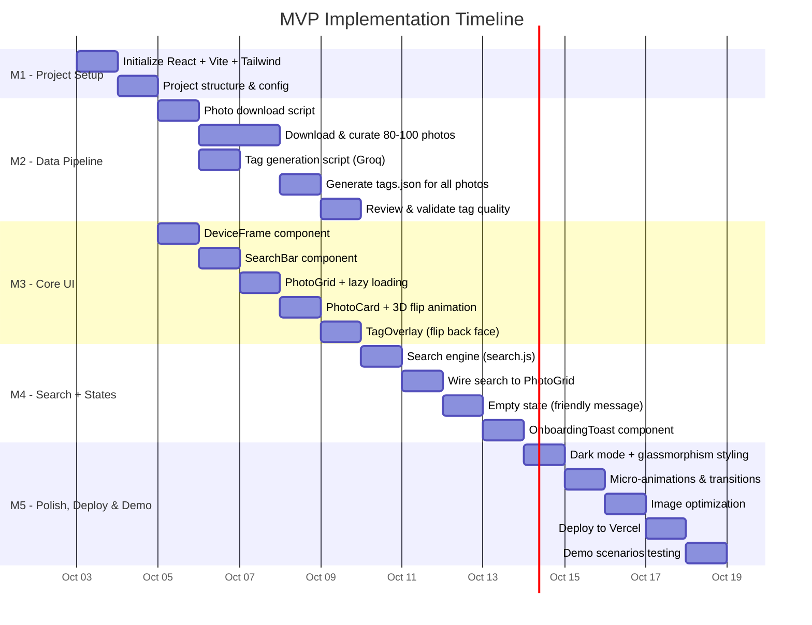

# 📅 Implementation Plan — Google Photos Memory Search MVP

> **Goal:** Ship a working demo where Priya can search her travel photos by sensory cues, moods, and visual descriptions — powered by pre-computed AI tags.

---

## Milestone Overview



---

## Milestone 1 — Project Setup & Scaffolding

> **Goal:** A running dev server with React + Vite + Tailwind CSS, empty component files in place.

### Tasks

| # | Task | Description | Output | Ref |
|---|------|-------------|--------|-----|
| 1.1 | **Initialize React + Vite** | Run `npx create-vite@latest ./ --template react` in project root | Working `npm run dev` with default Vite splash | [Architecture §5](file:///c:/Users/panka/Documents/Pankaj_CodeSpace/AI_Projects/GooglePhotos_MVP/docs/architecture.md#L580) |
| 1.2 | **Install Tailwind CSS** | Install `tailwindcss`, `postcss`, `autoprefixer`; configure `tailwind.config.js` and `postcss.config.js` | Tailwind utilities working in JSX | [Architecture §9](file:///c:/Users/panka/Documents/Pankaj_CodeSpace/AI_Projects/GooglePhotos_MVP/docs/architecture.md#L700) |
| 1.3 | **Set up `index.css`** | Add `@tailwind base; @tailwind components; @tailwind utilities;` + custom theme variables | Base styles applied | [Architecture §9](file:///c:/Users/panka/Documents/Pankaj_CodeSpace/AI_Projects/GooglePhotos_MVP/docs/architecture.md#L700) |
| 1.4 | **Create folder structure** | Create `src/components/`, `src/utils/`, `src/data/`, `public/photos/{city}/`, `scripts/` | All directories in place | [Architecture §5](file:///c:/Users/panka/Documents/Pankaj_CodeSpace/AI_Projects/GooglePhotos_MVP/docs/architecture.md#L580) |
| 1.5 | **Create empty component files** | Scaffold `DeviceFrame.jsx`, `SearchBar.jsx`, `PhotoGrid.jsx`, `PhotoCard.jsx`, `TagOverlay.jsx`, `OnboardingToast.jsx` with basic exports | All components importable | [Architecture §3.2](file:///c:/Users/panka/Documents/Pankaj_CodeSpace/AI_Projects/GooglePhotos_MVP/docs/architecture.md#L206) |
| 1.6 | **Install Google Fonts** | Add Inter font via `<link>` in `index.html` or `@import` in CSS | Typography applied globally | [Architecture §9](file:///c:/Users/panka/Documents/Pankaj_CodeSpace/AI_Projects/GooglePhotos_MVP/docs/architecture.md#L700) |

### ✅ Done When
- `npm run dev` starts without errors
- Browser shows an empty dark-themed page with Inter font
- All component files exist and export placeholder components

---

## Milestone 2 — Data Pipeline (Build-Time Scripts)

> **Goal:** 80–100 curated travel photos downloaded + a validated `tags.json` with AI-generated metadata for every photo.

### Tasks

| # | Task | Description | Output | Ref |
|---|------|-------------|--------|-----|
| 2.1 | **Write `download_photos.py`** | Python script that downloads photos from Unsplash → Pexels → Pixabay (fallback chain) based on search queries per city | Script file with CLI args for city/count | [Architecture §2.1](file:///c:/Users/panka/Documents/Pankaj_CodeSpace/AI_Projects/GooglePhotos_MVP/docs/architecture.md#L57) |
| 2.2 | **Define search queries per city** | Curate search terms for each city's famous spots + travel utility photos (see table below) | Query config in script | [Context §5](file:///c:/Users/panka/Documents/Pankaj_CodeSpace/AI_Projects/GooglePhotos_MVP/docs/context.md#L121) |
| 2.3 | **Download photos** | Run the script; download 80–100 photos into `public/photos/{city}/` | Organized photo folders | [Context §5](file:///c:/Users/panka/Documents/Pankaj_CodeSpace/AI_Projects/GooglePhotos_MVP/docs/context.md#L131) |
| 2.4 | **Manual curation pass** | Review downloaded photos for quality, variety, and relevance; replace weak ones | Curated, high-quality dataset | [Context §11](file:///c:/Users/panka/Documents/Pankaj_CodeSpace/AI_Projects/GooglePhotos_MVP/docs/context.md#L372) |
| 2.5 | **Write `generate_tags.py`** | Python script that sends each photo to Groq Vision API with the structured JSON prompt, handles rate limits and retries | Script file | [Architecture §2.2](file:///c:/Users/panka/Documents/Pankaj_CodeSpace/AI_Projects/GooglePhotos_MVP/docs/architecture.md#L101) |
| 2.6 | **Craft AI prompt** | Write the Vision-Language prompt that extracts `primary_subjects`, `descriptive_tags`, `sensory_cues`, `mood_and_tone`, `dominant_colors`, `alt_text`, `micro_story` | Prompt template in script | [Architecture §2.2](file:///c:/Users/panka/Documents/Pankaj_CodeSpace/AI_Projects/GooglePhotos_MVP/docs/architecture.md#L133) |
| 2.7 | **Generate `tags.json`** | Run the tag generation script across all photos | `src/data/tags.json` with 80–100 entries | [Architecture §2.2](file:///c:/Users/panka/Documents/Pankaj_CodeSpace/AI_Projects/GooglePhotos_MVP/docs/architecture.md#L155) |
| 2.8 | **Validate tag quality** | Spot-check 15–20 photos — verify tags are specific, not generic; sensory cues are evocative; stories feel personal | Validated, reviewed JSON | [Context §11](file:///c:/Users/panka/Documents/Pankaj_CodeSpace/AI_Projects/GooglePhotos_MVP/docs/context.md#L372) |

### Photo Search Queries (for Task 2.2)

| City | Search Terms |
|------|-------------|
| **Udaipur** | `City Palace Udaipur`, `Lake Pichola`, `Jag Mandir`, `Udaipur haveli`, `Rajasthani food dal baati`, `Udaipur sunset`, `Udaipur market` |
| **Manali** | `Rohtang Pass`, `Solang Valley snow`, `Manali pine forest`, `Old Manali cafe`, `Hidimba Temple`, `Manali river rafting`, `momos street food India` |
| **Hampi** | `Virupaksha Temple Hampi`, `Hampi stone chariot`, `Hampi boulders`, `Tungabhadra River`, `Hampi sunrise ruins`, `Hampi coracle ride` |
| **Goa** | `Palolem beach Goa`, `Anjuna beach`, `Basilica Bom Jesus Goa`, `Goa beach shack`, `Goa seafood`, `Fort Aguada` |
| **Travel Utility** | `boarding pass`, `hotel booking confirmation`, `train ticket India`, `airport terminal sign`, `restaurant bill receipt`, `Google Maps navigation` |

### ✅ Done When
- `public/photos/` contains 80–100 organized photos across 5 folders
- `src/data/tags.json` has a valid entry for every photo
- Tags are specific and differentiated (not generic `"beautiful"` everywhere)
- Micro-stories mention Priya and feel personal

---

## Milestone 3 — Core UI Components

> **Goal:** A visually polished photo grid with search bar, card flip animation, and phone frame — rendering all photos from `tags.json`.

### Tasks

| # | Task | Description | Output | Ref |
|---|------|-------------|--------|-----|
| 3.1 | **Build `DeviceFrame.jsx`** | Phone bezel wrapper with notch, rounded corners, shadow; hidden on mobile (≤480px) | Component rendering children inside a phone frame | [Architecture §3.2 DeviceFrame](file:///c:/Users/panka/Documents/Pankaj_CodeSpace/AI_Projects/GooglePhotos_MVP/docs/architecture.md#L225) |
| 3.2 | **Build `SearchBar.jsx`** | Sticky search input with glassmorphism, search icon, clear ✕ button, 200ms debounce; placeholder: *"Search memories… try 'golden sunset lake'"* | Controlled input component | [Architecture §3.2 SearchBar](file:///c:/Users/panka/Documents/Pankaj_CodeSpace/AI_Projects/GooglePhotos_MVP/docs/architecture.md#L259) |
| 3.3 | **Build `PhotoGrid.jsx`** | 2-column CSS grid, city label dividers, lazy loading via `IntersectionObserver`, fade-in transitions | Grid rendering photo cards | [Architecture §3.2 PhotoGrid](file:///c:/Users/panka/Documents/Pankaj_CodeSpace/AI_Projects/GooglePhotos_MVP/docs/architecture.md#L277) |
| 3.4 | **Build `PhotoCard.jsx`** | Flippable card with CSS 3D transforms — `perspective(1000px)`, `rotateY(180deg)`, `backface-visibility: hidden`; 0.6s transition | Card with front (photo) and back (overlay) | [Architecture §3.2 PhotoCard](file:///c:/Users/panka/Documents/Pankaj_CodeSpace/AI_Projects/GooglePhotos_MVP/docs/architecture.md#L316) |
| 3.5 | **Build `TagOverlay.jsx`** | Back face content: micro-story (italic, top), color-coded tag pills in flex wrap, dark blurred background | Tag display component | [Architecture §3.2 TagOverlay](file:///c:/Users/panka/Documents/Pankaj_CodeSpace/AI_Projects/GooglePhotos_MVP/docs/architecture.md#L360) |
| 3.6 | **Wire `App.jsx`** | Import `tags.json`, set up state (`allPhotos`, `searchQuery`, `filteredPhotos`), render `DeviceFrame` > `SearchBar` + `PhotoGrid` | Working app layout with all photos displayed | [Architecture §3.2 App](file:///c:/Users/panka/Documents/Pankaj_CodeSpace/AI_Projects/GooglePhotos_MVP/docs/architecture.md#L206) |
| 3.7 | **Responsive layout** | Verify phone frame on desktop/tablet, edge-to-edge on mobile; test at 375px, 768px, 1440px | Correct layout at all breakpoints | [Architecture §6](file:///c:/Users/panka/Documents/Pankaj_CodeSpace/AI_Projects/GooglePhotos_MVP/docs/architecture.md#L610) |

### Tag Pill Color Map (for Task 3.5)

| Category | Tailwind Classes |
|----------|-----------------|
| `primary_subjects` | `bg-blue-500/20 text-blue-300` |
| `sensory_cues` | `bg-amber-500/20 text-amber-300` |
| `mood_and_tone` | `bg-purple-500/20 text-purple-300` |
| `dominant_colors` | `bg-emerald-500/20 text-emerald-300` |
| `descriptive_tags` | `bg-slate-500/20 text-slate-300` |

### ✅ Done When
- All photos render in a grid, grouped by city
- Clicking a photo flips it to show micro-story + tags
- Search bar is visible and sticky
- Phone frame shows on desktop; disappears on mobile
- Lazy loading works (images load as user scrolls)

---

## Milestone 4 — Search Engine + App States

> **Goal:** Search works end-to-end — type a query, see filtered results, see friendly empty state when nothing matches, see onboarding toast on first visit.

### Tasks

| # | Task | Description | Output | Ref |
|---|------|-------------|--------|-----|
| 4.1 | **Implement `search.js`** | Client-side scoring engine: tokenize query → match across 6 tag fields → score → rank → return filtered array | Utility function | [Architecture §3.3](file:///c:/Users/panka/Documents/Pankaj_CodeSpace/AI_Projects/GooglePhotos_MVP/docs/architecture.md#L400) |
| 4.2 | **Wire search to grid** | Connect `SearchBar` → `search.js` → `PhotoGrid` via `App.jsx` state; debounced `onChange` → `setFilteredPhotos` | Live search filtering | [Architecture §4.1](file:///c:/Users/panka/Documents/Pankaj_CodeSpace/AI_Projects/GooglePhotos_MVP/docs/architecture.md#L460) |
| 4.3 | **Build empty state UI** | When search returns 0 results: show 🔍 icon, *"No memories matched your search"*, subtext *"Try describing what you remember — a color, a feeling, or a scene"*, clickable suggestion pill (`golden sunset lake`) that auto-fills search | Empty state component | [Architecture §3.2 PhotoGrid — Empty State Spec](file:///c:/Users/panka/Documents/Pankaj_CodeSpace/AI_Projects/GooglePhotos_MVP/docs/architecture.md#L287) |
| 4.4 | **Build `OnboardingToast.jsx`** | Floating bottom toast: ✨ *"Tap any photo to reveal the AI-generated story and tags behind it"*; ✕ dismiss button; auto-dismiss 8s; `localStorage` persistence; also dismissed on first card flip | Toast component | [Context §9 Toast](file:///c:/Users/panka/Documents/Pankaj_CodeSpace/AI_Projects/GooglePhotos_MVP/docs/context.md#L321) |
| 4.5 | **Clear search** | ✕ button in SearchBar clears query → resets grid to all photos | Full grid restored | [Architecture §4.2](file:///c:/Users/panka/Documents/Pankaj_CodeSpace/AI_Projects/GooglePhotos_MVP/docs/architecture.md#L500) |
| 4.6 | **Test search scenarios** | Validate all 5 example queries from context.md work correctly (see table below) | All scenarios pass | [Context §8](file:///c:/Users/panka/Documents/Pankaj_CodeSpace/AI_Projects/GooglePhotos_MVP/docs/context.md#L267) |

### Search Test Scenarios (for Task 4.6)

| # | Query | Expected Behavior |
|---|-------|-------------------|
| 1 | `calm lake palace` | Surfaces Udaipur lake/palace photos |
| 2 | `snow mountains road` | Surfaces Manali mountain/snow photos |
| 3 | `big rocks temple ruins` | Surfaces Hampi boulder/temple photos |
| 4 | `golden sunset beach` | Surfaces Goa sunset/beach photos |
| 5 | `boarding pass flight` | Surfaces travel utility boarding pass photos |
| 6 | `xyznonexistent` | Shows friendly empty state with suggestion pill |
| 7 | *(empty)* | Shows all photos (full grid restored) |

### ✅ Done When
- All 7 search test scenarios pass
- Empty state shows the friendly message + clickable suggestion
- Onboarding toast appears on first visit, persists dismissal in localStorage
- Toast auto-dismisses after 8s or on first card flip
- Clear button restores full grid

---

## Milestone 5 — Polish, Deploy & Demo Prep

> **Goal:** A visually stunning, demo-ready MVP deployed live on Vercel that would impress stakeholders at first glance.

### Tasks

| # | Task | Description | Output | Ref |
|---|------|-------------|--------|-----|
| 5.1 | **Dark mode theme** | Apply consistent dark palette: `bg-gray-950` body, `bg-gray-900` cards, `text-gray-100` primary text, `text-gray-400` muted | Cohesive dark theme | [Context §9 Design](file:///c:/Users/panka/Documents/Pankaj_CodeSpace/AI_Projects/GooglePhotos_MVP/docs/context.md#L337) |
| 5.2 | **Glassmorphism effects** | Apply `backdrop-blur-xl bg-white/10` to: search bar, onboarding toast, tag overlay back face | Frosted glass aesthetics | [Context §9 Design](file:///c:/Users/panka/Documents/Pankaj_CodeSpace/AI_Projects/GooglePhotos_MVP/docs/context.md#L337) |
| 5.3 | **Micro-animations** | Add: fade-in on photo load, slide-up on toast appear, scale-up on card hover, smooth grid re-layout on search | Alive, responsive UI | [Context §9 Design](file:///c:/Users/panka/Documents/Pankaj_CodeSpace/AI_Projects/GooglePhotos_MVP/docs/context.md#L337) |
| 5.4 | **Phone frame polish** | Refine bezel, add notch, status bar time/battery indicators (static), subtle outer glow/shadow | Realistic device feel | [Architecture §6.3](file:///c:/Users/panka/Documents/Pankaj_CodeSpace/AI_Projects/GooglePhotos_MVP/docs/architecture.md#L635) |
| 5.5 | **Image optimization** | Resize all photos to max 1200px width; compress to ~80% JPEG quality; verify total asset size is reasonable (<20MB) | Optimized photo assets | [Architecture §7](file:///c:/Users/panka/Documents/Pankaj_CodeSpace/AI_Projects/GooglePhotos_MVP/docs/architecture.md#L660) |
| 5.6 | **Typography hierarchy** | Ensure Inter font loads; set proper heading/body/muted sizes; city divider labels styled distinctly | Clean typography | [Architecture §9](file:///c:/Users/panka/Documents/Pankaj_CodeSpace/AI_Projects/GooglePhotos_MVP/docs/architecture.md#L700) |
| 5.7 | **Cross-device testing** | Test on: Chrome Desktop (1440px), iPad viewport (768px), iPhone/Pixel viewport (375px) | Works across all viewports | [Architecture §6](file:///c:/Users/panka/Documents/Pankaj_CodeSpace/AI_Projects/GooglePhotos_MVP/docs/architecture.md#L610) |
| 5.8 | **Deploy to Vercel** | Connect GitHub repo to Vercel; trigger first deploy; verify live URL loads correctly with all photos and search working | Live URL: `project-name.vercel.app` | [Architecture §10](file:///c:/Users/panka/Documents/Pankaj_CodeSpace/AI_Projects/GooglePhotos_MVP/docs/architecture.md#L829) |
| 5.9 | **Verify production build** | Test the live Vercel deployment — check photo loading, search, card flip, onboarding toast, empty state, responsive layout | All features working on production | [Architecture §10](file:///c:/Users/panka/Documents/Pankaj_CodeSpace/AI_Projects/GooglePhotos_MVP/docs/architecture.md#L829) |
| 5.10 | **Demo scenario walkthrough** | Prepare 3 demo flows for presentation (see below) | Rehearsed demo script | [Context §10](file:///c:/Users/panka/Documents/Pankaj_CodeSpace/AI_Projects/GooglePhotos_MVP/docs/context.md#L347) |

### Vercel Deployment Steps (for Task 5.8)

1. Push code to GitHub (ensure `public/photos/` is committed or handled via Git LFS if >50MB)
2. Go to [vercel.com](https://vercel.com) → Import GitHub repository
3. Vercel auto-detects Vite → uses `npm run build` → outputs to `dist/`
4. No `vercel.json` needed — defaults work
5. Live at `https://<project-name>.vercel.app`
6. Every subsequent push to `main` auto-deploys

> [!NOTE]
> **Backup platform:** If Vercel has issues, [Netlify](https://netlify.com) is a drop-in alternative with identical Git-push deploy workflow for static Vite apps.

### Demo Flows (for Task 5.8)

**Demo 1 — "The Beach Memory"** (addresses Priya's core frustration)
1. Open the app → full photo grid loads
2. Notice the onboarding toast → read and dismiss
3. Type `beach rocks sunset` → Goa/Hampi beach photos surface
4. Flip a card → show the AI story and sensory tags
5. **Narrative:** *"Priya remembers a beach with big rocks. Today, she finds it."*

**Demo 2 — "The Sensory Search"** (showcases the cognitive mismatch fix)
1. Type `peaceful golden warm` → Udaipur sunset/lake photos surface
2. Flip a card → show tags like `serene`, `golden light`, `warm glow`
3. Clear search → full grid restores
4. **Narrative:** *"She didn't search for 'Udaipur' or 'November 2025'. She searched how it felt."*

**Demo 3 — "The Utility Recall"** (shows travel document retrieval)
1. Type `boarding pass flight` → travel utility photos surface
2. Flip a boarding pass card → show extracted text-like tags
3. **Narrative:** *"At the airport counter, Priya finds her boarding pass in 3 seconds."*

### ✅ Done When
- Dark mode + glassmorphism applied everywhere
- Animations feel smooth at 60fps
- Phone frame looks realistic with notch
- **App is live on Vercel** with a shareable URL
- All features work on the production deployment (photos load, search works, card flip works)
- All 3 demo flows work end-to-end without hiccups
- Total page load under 3 seconds on fast 3G

---

## Task Dependency Graph

```mermaid
graph TD
    M1["🔧 M1: Project Setup"] --> M2["📸 M2: Data Pipeline"]
    M1 --> M3["🖼️ M3: Core UI"]
    M2 --> M4["🔍 M4: Search + States"]
    M3 --> M4
    M4 --> M5["✨ M5: Polish & Demo"]

    subgraph "M1 Tasks"
        T11["1.1 Init Vite"] --> T12["1.2 Install Tailwind"]
        T12 --> T13["1.3 Setup index.css"]
        T13 --> T14["1.4 Create folders"]
        T14 --> T15["1.5 Scaffold components"]
        T15 --> T16["1.6 Google Fonts"]
    end

    subgraph "M2 Tasks"
        T21["2.1 Download script"] --> T22["2.2 Search queries"]
        T22 --> T23["2.3 Download photos"]
        T21b["2.5 Tag gen script"] --> T26["2.6 AI prompt"]
        T23 --> T24["2.4 Curate photos"]
        T24 --> T27["2.7 Generate tags.json"]
        T26 --> T27
        T27 --> T28["2.8 Validate quality"]
    end

    subgraph "M3 Tasks"
        T31["3.1 DeviceFrame"] --> T36["3.6 Wire App.jsx"]
        T32["3.2 SearchBar"] --> T36
        T33["3.3 PhotoGrid"] --> T36
        T34["3.4 PhotoCard"] --> T35["3.5 TagOverlay"]
        T35 --> T36
        T36 --> T37["3.7 Responsive test"]
    end

    subgraph "M4 Tasks"
        T41["4.1 search.js"] --> T42["4.2 Wire to grid"]
        T42 --> T43["4.3 Empty state"]
        T43 --> T44["4.4 OnboardingToast"]
        T42 --> T45["4.5 Clear search"]
        T44 --> T46["4.6 Test scenarios"]
        T45 --> T46
    end

    subgraph "M5 Tasks"
        T51["5.1 Dark theme"] --> T52["5.2 Glassmorphism"]
        T52 --> T53["5.3 Animations"]
        T53 --> T54["5.4 Frame polish"]
        T54 --> T55["5.5 Image optimization"]
        T55 --> T56["5.6 Typography"]
        T56 --> T57["5.7 Cross-device test"]
        T57 --> T58["5.8 Deploy to Vercel"]
        T58 --> T59["5.9 Verify production"]
        T59 --> T510["5.10 Demo walkthrough"]
    end

    style M1 fill:#1e40af,stroke:#60a5fa,color:#e2e8f0
    style M2 fill:#b45309,stroke:#f59e0b,color:#e2e8f0
    style M3 fill:#7c3aed,stroke:#a78bfa,color:#e2e8f0
    style M4 fill:#059669,stroke:#34d399,color:#e2e8f0
    style M5 fill:#db2777,stroke:#f472b6,color:#e2e8f0
```



---

## Parallel Work Opportunities

Some milestones have tasks that can run in parallel to speed up delivery:

| Parallel Track A | Parallel Track B | When |
|-----------------|-----------------|------|
| M2: Download + curate photos (Tasks 2.1–2.4) | M3: Build UI components (Tasks 3.1–3.5) | After M1 completes |
| M2: Tag generation script (Tasks 2.5–2.6) | M3: Build remaining UI (Tasks 3.3–3.5) | During M2 photo download |

> [!TIP]
> M2 (data pipeline) and M3 (core UI) can be developed **simultaneously** since they have no dependencies on each other. M3 can use a mock `tags.json` with 5–10 sample entries while M2 finishes generating the full dataset.

---

## Mock Data for Parallel Development

While M2 is running, M3 can use this mock `tags.json` (3 sample entries) to build and test UI components:

```json
{
  "generated_at": "2026-10-03T00:00:00Z",
  "model": "mock",
  "total_photos": 3,
  "photos": [
    {
      "id": "udaipur_001",
      "filename": "udaipur_001.jpg",
      "city": "Udaipur",
      "primary_subjects": ["palace", "lake", "reflection"],
      "descriptive_tags": ["white marble palace", "calm lake water", "evening sky"],
      "sensory_cues": ["serene", "golden light", "still water", "warm glow"],
      "mood_and_tone": ["peaceful", "majestic"],
      "dominant_colors": ["gold", "white", "deep blue"],
      "alt_text": "City Palace reflected in Lake Pichola at golden hour",
      "micro_story": "The last light painted the City Palace in gold as Priya watched its reflection shimmer on the lake."
    },
    {
      "id": "manali_001",
      "filename": "manali_001.jpg",
      "city": "Manali",
      "primary_subjects": ["mountains", "snow", "pine trees"],
      "descriptive_tags": ["snow-capped peaks", "dense pine forest", "winding mountain road"],
      "sensory_cues": ["crisp air", "cold", "fresh pine", "crunchy snow"],
      "mood_and_tone": ["adventurous", "exhilarating"],
      "dominant_colors": ["white", "forest green", "sky blue"],
      "alt_text": "Snow-covered mountain peaks behind a pine forest in Manali",
      "micro_story": "Priya rolled down the car window and let the freezing mountain air hit her face. The peaks looked unreal."
    },
    {
      "id": "utility_001",
      "filename": "utility_001.jpg",
      "city": "Travel Utility",
      "primary_subjects": ["boarding pass", "airline ticket"],
      "descriptive_tags": ["printed boarding pass", "flight details", "seat number"],
      "sensory_cues": ["paper texture", "crumpled edges"],
      "mood_and_tone": ["functional", "anticipatory"],
      "dominant_colors": ["white", "blue", "gray"],
      "alt_text": "A printed boarding pass for a domestic flight in India",
      "micro_story": "Priya fished the crumpled boarding pass from her jacket pocket just as they called her boarding group."
    }
  ]
}
```

---

## References

- [context.md](file:///c:/Users/panka/Documents/Pankaj_CodeSpace/AI_Projects/GooglePhotos_MVP/docs/context.md) — Project scope, persona, solution rationale, photo dataset plan, search strategy
- [architecture.md](file:///c:/Users/panka/Documents/Pankaj_CodeSpace/AI_Projects/GooglePhotos_MVP/docs/architecture.md) — Component specs, data flows, state management, responsive layout, configuration
